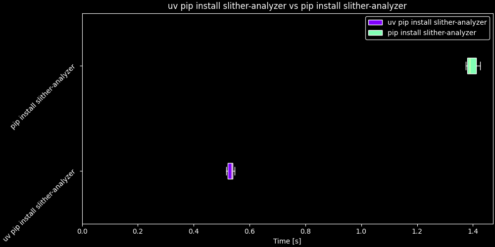
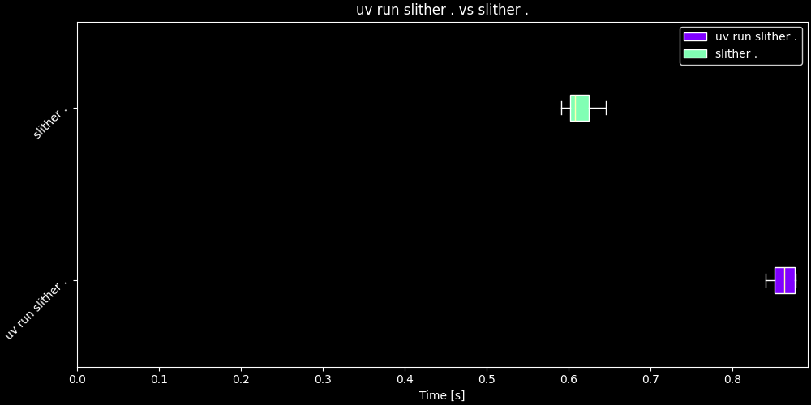

<a href="https://github.com/xyizko/xo-Investigations" target=_blank>

</a>

<h1 align="center"><code>xo-i-euvs</code></h1>
<h2 align="center"><i>Comparing Execution with uv vs pip</i></h2>

---

1. [What ?](#what-)
   1. [Findings](#findings)
2. [Methodology](#methodology)
3. [Installation Times](#installation-times)
   1. [Results](#results)
      1. [Summaries](#summaries)
      2. [Whisker Plot](#whisker-plot)
4. [`slither` Execution Times](#slither-execution-times)
   1. [Methodology](#methodology-1)
      1. [Summaries](#summaries-1)
      2. [Whisker Plot](#whisker-plot-1)
5. [Methods](#methods)

---

# What ?

Execution times comparison of [`slither`](https://github.com/crytic/slither) with `uv` vs pip using [`hyperfine`](https://lib.rs/crates/hyperfine)

## Findings

| Procedure        | Result                                                          |
| ---------------- | --------------------------------------------------------------- |
| Installation     | `uv` was `~60` times faster than with `pip`                     |
| Binary Execution | `uv run slither .` was ~ `1` times faster than with 'slither .' |

# Methodology

The following parameters were used when executing hyperfine

```ml
hyperfine \
    -N \
    --warmup 20 \
    "uv pip install slither-analyzer" \
    "pip install slither-analyzer"
```

- Actual commands and paramters used for testing

# Installation Times

> Installation times are significantly faster

## Results

### Summaries

```js
Summary

uv pip install slither-analyzer ran
   88.75 ± 27.40 times faster than pip install slither-analyzer
```

- Automated generated summary between operations

| Command                           |     Mean [ms] | Min [ms] | Max [ms] |      Relative |
| :-------------------------------- | ------------: | -------: | -------: | ------------: |
| `uv pip install slither-analyzer` |    11.1 ± 2.5 |      8.4 |     21.2 |          1.00 |
| `pip install slither-analyzer`    | 988.2 ± 212.0 |    836.9 |   1489.7 | 88.75 ± 27.40 |

- Automated generated timings comparison
- Observe the `Relative` cell, where the number (along with standard deviation) represents the number of times greate from the value of `1.00`

### Whisker Plot



- Since there is a signifiant difference the purple element is compressed.

# `slither` Execution Times

> Execution times were found to be slightly faster

## Methodology

1. Initialize a new python project via `uv init`
2. Withing the project initialize a new [`forge`](https://github.com/foundry-rs/foundry)
3. Run `slither` with both methods
4. Execute same command with parameters as with previous test

### Summaries

```ml
Summary

uv run slither . ran
    1.10 ± 0.15 times faster than slither .
```

| Command            |    Mean [ms] | Min [ms] | Max [ms] |    Relative |
| :----------------- | -----------: | -------: | -------: | ----------: |
| `uv run slither .` | 459.1 ± 39.2 |    406.6 |    540.6 |        1.00 |
| `slither .`        | 506.2 ± 51.0 |    446.9 |    606.3 | 1.10 ± 0.15 |

### Whisker Plot



# Methods

Refer to [`this`](./methods/README.MD)
